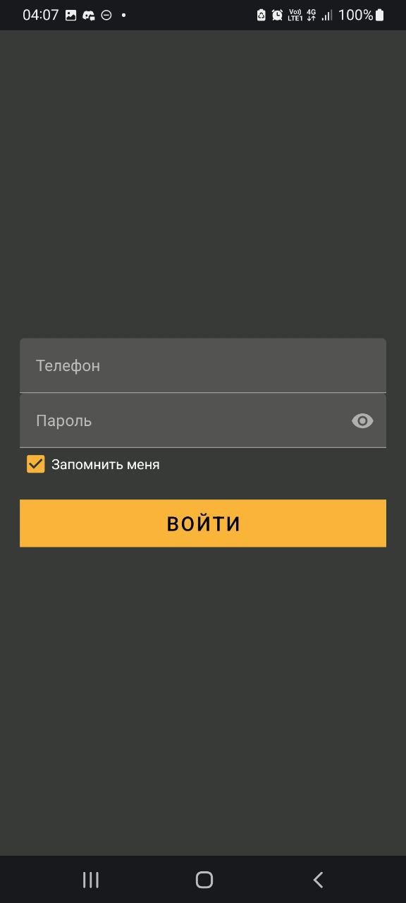
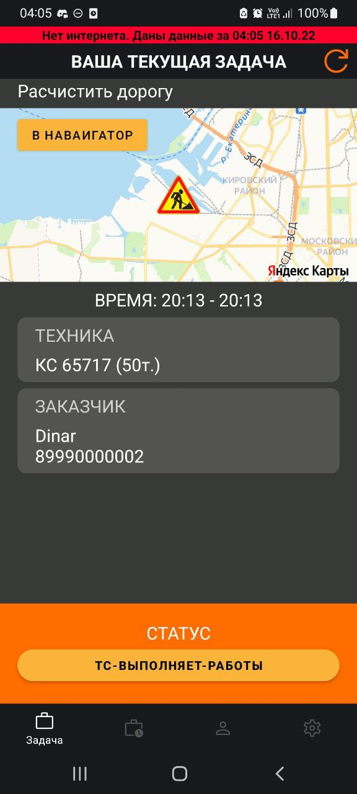
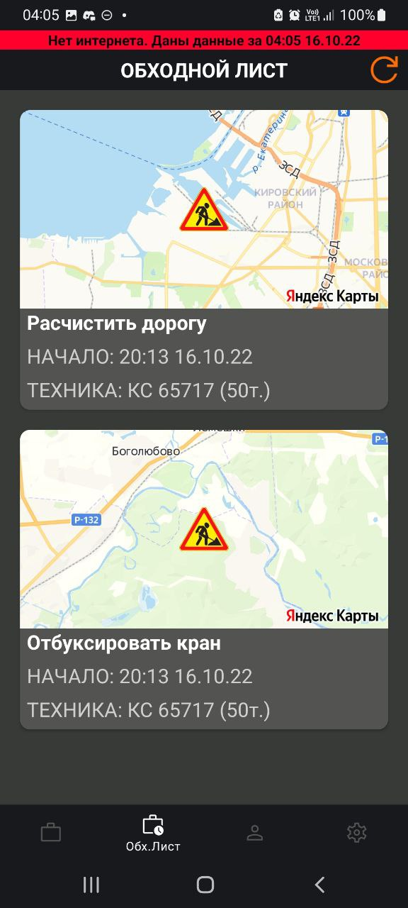

<b>
  

    Всё приложение было написано за 48 часов. В код не вносились изменения после завершения хакатона, несмотря на то, что в приложении есть что исправить и отрефакторить.
  

   
  

    Стек технологий: Retrofit, Room, Koin, Kotlin Coroutines, MapKit (API Яндекс Карт), Fragments
  

  

    Навигация между экранами: Cicerone с кастомным mutlibackstack-ом.
  

</b>

Диспетчер Полюс - это Android-клиент приложения "Диспетчеру никто не пишет". Приложение было разработано в составе команды "build" в ходе хакатона от компании Полюс. Приложение "Диспетчеру никто не пишет" - это автоматизированная система бронирования и предоставления технологического транспорта. Приложение "Диспетчер Полюс" представляет собой Android-клиент, предназначенный для водителя транспортного средства для получения списка назначенных на него заказов и для изменения статуса текущего заказа. При отсутствии интернет-соединения приложение может работать автономно. Для реализации карт приложение использует MapKit, API карт от Яндекса.

  Видео-демонстрация работы приложения:
  <a href="https://github.com/GrishaninVyacheslav/polus-dispatcher-android/blob/master/document_5359615836715752364.mp4" target="_blank" rel="noopener noreferrer">
    document_5359615836715752364.mp4
  </a>

  Презентация приложения: 
  <a href="https://github.com/GrishaninVyacheslav/polus-dispatcher-android/blob/master/Hack.pdf" target="_blank" rel="noopener noreferrer">
    Hack.pdf
  </a>

  
  
  

